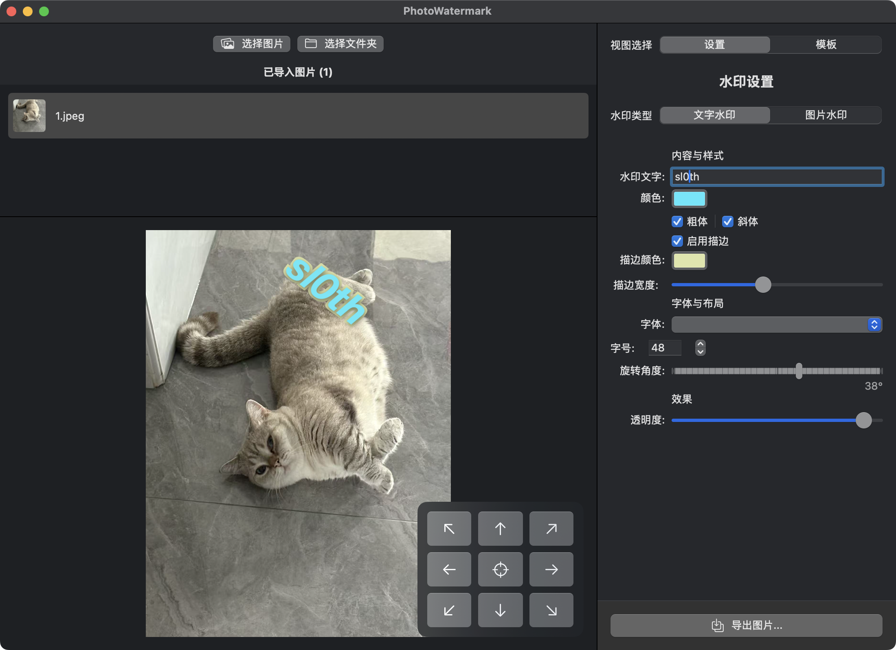

# PhotoWatermark for macOS

一款为 macOS 设计的轻量、高效且易于使用的桌面应用程序，用于给单张或批量图片添加自定义的文字或图片水印。

## ✨ 核心功能

- **多种导入方式**：支持拖拽文件/文件夹、或通过文件选择器导入图片。
- **实时预览**：所有水印调整都可以在主界面上实时看到效果，所见即所得。
- **灵活的水印类型**：
  - **文字水印**：自定义文本内容、字体、字号、颜色、透明度。
  - **图片水印**：支持选择本地图片（如 Logo）作为水印，并调整其缩放和透明度。
- **丰富的样式选项**：
  - 支持文本**加粗**和**斜体**样式。
  - 可为文字添加**描边（轮廓）**，并自定义描边颜色和宽度。
  - 支持**任意角度旋转**水印。
- **精确定位**：提供九宫格快速定位，也支持在预览区直接拖拽水印到任意位置。
- **模板化管理**：可将当前的水印设置保存为模板，方便随时加载和管理，提高效率。
- **强大的导出功能**：
  - 支持批量导出处理后的图片。
  - 自定义输出格式（PNG, JPEG）。
  - 灵活的文件命名规则（保留原名、添加前缀/后缀）。
  - 可在导出时按宽度、高度或百分比缩放图片尺寸。

## 🚀 如何安装和运行

1. 下载应用：

   从本仓库的 Releases 页面 下载最新的 .dmg 文件。

2. **安装应用**：

   - 双击下载的 `.dmg` 文件，会打开一个类似虚拟磁盘的窗口。
   - 将 `PhotoWatermark.app` 图标拖拽到 `Applications` (应用程序) 文件夹的快捷方式上。

3. 首次运行（重要）：

   由于应用未经苹果官方公证，在首次打开时会遇到安全提示。请按以下步骤操作：

   - 在“应用程序”文件夹中找到 `PhotoWatermark.app`。
   - **按住 Control 键，然后右键点击应用图标**。
   - 从弹出的快捷菜单中选择 **打开 (Open)**。
   - 在再次出现的警告窗口中，点击 **“打开”** 按钮即可启动应用。

   此操作只需在第一次运行时执行一次。

## 🛠️ 使用指南

1. **导入图片**：通过窗口上方的“选择图片”/“选择文件夹”按钮，或直接将图片/文件夹拖拽到左上方的文件列表区域。
2. **选择图片进行预览**：在左上方的文件列表中单击一张图片，它会显示在下方的预览区。
3. **调整水印**：在最右侧的设置面板中：
   - 选择“文字水印”或“图片水印”。
   - 调整内容、颜色、字体、描边、旋转、透明度等参数。
   - 所有调整会实时显示在预览区的图片上。
   - 可以通过拖拽或点击预览区右下角的九宫格来调整水印位置。
4. **使用模板 (可选)**：
   - 在右侧面板切换到“模板”标签页。
   - 点击 `+` 按钮可以将当前设置保存为新模板。
   - 点击列表中的模板项可以快速应用保存的设置。
5. **导出图片**：
   - 点击右下角的“导出图片...”按钮。
   - 在弹出的窗口中设置导出范围、命名规则、格式和尺寸。
   - 选择一个保存位置，开始导出。

## 🖥️ 环境支持

本项目在以下环境中开发和测试：

- **操作系统**: macOS 15.5
- **硬件架构**: Apple Silicon (arm64)

理论上支持运行 macOS 15.0 及以上版本的 Apple Silicon Mac 设备。

## 📄 开源许可

本项目基于 [MIT License](https://www.google.com/search?q=LICENSE) 开源。
